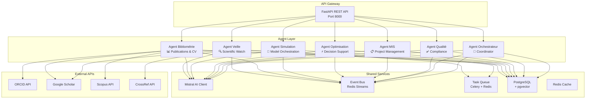

# 🏗️ Implementation Plan — AI Agent System for Research Laboratory Platform

## Overview

Build **7 AI agents** that form the intelligent core of a research laboratory platform. Each agent is an autonomous microservice connected via an event bus, powered by **Mistral AI** for text intelligence, and governed by human-in-the-loop policies.

> [!IMPORTANT]
> **Excluded from this phase**: Agent Ingestion IoT (will be built later when digital twins are implemented).

---

## Proposed Tech Stack

| Layer | Technology | Rationale |
|-------|-----------|-----------|
| **Backend framework** | **FastAPI** (Python 3.12+) | Async-native, perfect for agent workers and REST APIs. Fastest Python framework. |
| **Database** | **PostgreSQL 16** + pgvector | Structured data + vector embeddings for semantic search in Veille agent |
| **Cache / Broker** | **Redis 7** (with Streams) | Task queue, caching, and lightweight event streaming |
| **Event bus** | **Redis Streams** (start) → Kafka (later) | Redis Streams is simpler to deploy and sufficient for 7 agents. Migrate to Kafka when IoT/Digital Twins arrive. |
| **Task queue** | **Celery** with Redis broker | Scheduled and async tasks (scraping, PDF generation, model runs) |
| **LLM** | **Mistral AI API** (mistral-large / mistral-small) | Team's choice. `mistral-large` for complex reasoning, `mistral-small` for high-volume tagging/summaries |
| **PDF generation** | **WeasyPrint** | HTML → PDF for CV exports, reports, policy briefs |
| **API integrations** | `httpx` (async HTTP) | For ORCID, Google Scholar, Scopus, CrossRef APIs |
| **Testing** | `pytest` + `pytest-asyncio` + `httpx` | Unit + integration tests |
| **Containerization** | **Docker** + **Docker Compose** | Local dev environment with all services |
| **CI/CD** | **GitHub Actions** | Automated testing, linting, security scans |

> [!NOTE]
> We start with **Redis Streams** instead of Kafka to reduce infrastructure complexity. The event contract stays the same — swapping to Kafka later is a config change, not a rewrite.

---

## Architecture

### High-Level Design



### Shared Agent Framework

Every agent inherits from a common `BaseAgent` class to enforce consistent behavior:

```python
# Pseudocode — actual implementation will be more detailed
class BaseAgent:
    name: str
    permissions: list[str]
    requires_human_approval: list[str]  # action types needing review

    async def handle_event(self, event: Event) -> AgentAction
    async def propose_action(self, action: AgentAction) -> None  # → human review queue
    async def execute_action(self, action: AgentAction) -> ActionResult
    async def emit_event(self, event: Event) -> None
    async def log_audit(self, entry: AuditEntry) -> None
```

**Key principles**:
- **Event-driven**: Agents communicate via events, not direct calls
- **Human-in-the-loop**: Sensitive actions go to a review queue before execution
- **Audit trail**: Every action is logged with provenance
- **Governance**: Each agent declares its permissions; the Orchestrateur enforces policies

---

## Project Structure (Monorepo)

```
intern/
├── docker-compose.yml
├── .env.example
├── .github/
│   └── workflows/
│       ├── ci.yml
│       └── lint.yml
├── shared/                          # Shared framework (everyone contributes)
│   ├── __init__.py
│   ├── base_agent.py               # BaseAgent class
│   ├── event_bus.py                # Redis Streams wrapper
│   ├── llm_client.py              # Mistral AI client (with retry, rate limiting)
│   ├── database.py                # SQLAlchemy async session + models base
│   ├── schemas.py                 # Pydantic base schemas (Event, Action, AuditEntry)
│   ├── config.py                  # Settings (env-based via pydantic-settings)
│   ├── security.py                # Auth utilities, RBAC helpers
│   └── pdf_generator.py           # WeasyPrint wrapper
│
├── agents/
│   ├── veille/                     # Agent Veille
│   │   ├── __init__.py
│   │   ├── agent.py               # VeilleAgent(BaseAgent)
│   │   ├── models.py              # DB models (Article, Source, Alert, Tag)
│   │   ├── schemas.py             # Pydantic schemas
│   │   ├── services/
│   │   │   ├── scraper.py         # Source collectors (RSS, APIs)
│   │   │   ├── deduplicator.py    # Embedding-based dedup
│   │   │   ├── tagger.py          # Mistral-powered thematic tagging
│   │   │   └── summarizer.py      # Vulgarized summaries
│   │   ├── tasks.py               # Celery tasks (scheduled scraping)
│   │   ├── router.py              # FastAPI router
│   │   └── tests/
│   │
│   ├── bibliometrie/               # Agent Bibliométrie
│   │   ├── agent.py
│   │   ├── models.py              # Publication, Researcher, CVProfile
│   │   ├── schemas.py
│   │   ├── services/
│   │   │   ├── orcid_sync.py      # ORCID API integration
│   │   │   ├── scholar_sync.py    # Google Scholar scraper
│   │   │   ├── indicators.py      # h-index, citations, impact factor
│   │   │   └── cv_generator.py    # Interactive CV + PDF export
│   │   ├── tasks.py
│   │   ├── router.py
│   │   └── tests/
│   │
│   ├── simulation/                 # Agent Simulation
│   │   ├── agent.py
│   │   ├── models.py              # Scenario, ModelRun, CalibrationLog
│   │   ├── schemas.py
│   │   ├── services/
│   │   │   ├── model_registry.py  # Register/discover simulation models
│   │   │   ├── scenario_manager.py
│   │   │   ├── calibrator.py      # Bayesian/GA parameter tuning
│   │   │   └── runners/
│   │   │       ├── base_runner.py
│   │   │       ├── swat_runner.py
│   │   │       ├── epanet_runner.py
│   │   │       └── fao56_runner.py
│   │   ├── tasks.py
│   │   ├── router.py
│   │   └── tests/
│   │
│   ├── optimisation/               # Agent Optimisation
│   │   ├── agent.py
│   │   ├── models.py              # OptimizationRun, Constraint, Recommendation
│   │   ├── schemas.py
│   │   ├── services/
│   │   │   ├── optimizer.py       # Multi-objective optimization
│   │   │   ├── constraint_solver.py
│   │   │   └── strategy_generator.py  # Mistral-powered recommendations
│   │   ├── tasks.py
│   │   ├── router.py
│   │   └── tests/
│   │
│   ├── mis/                        # Agent MIS
│   │   ├── agent.py
│   │   ├── models.py              # Project, Personnel, Equipment, Budget
│   │   ├── schemas.py
│   │   ├── services/
│   │   │   ├── project_tracker.py
│   │   │   ├── hr_manager.py
│   │   │   ├── equipment_manager.py
│   │   │   ├── budget_monitor.py
│   │   │   └── report_generator.py
│   │   ├── tasks.py
│   │   ├── router.py
│   │   └── tests/
│   │
│   ├── qualite/                    # Agent Qualité & Conformité
│   │   ├── agent.py
│   │   ├── models.py              # AuditLog, ConsentRecord, ComplianceCheck
│   │   ├── schemas.py
│   │   ├── services/
│   │   │   ├── data_validator.py  # Cross-entity consistency checks
│   │   │   ├── rgpd_checker.py    # GDPR compliance verification
│   │   │   ├── access_auditor.py  # Permission & access auditing
│   │   │   └── report_generator.py
│   │   ├── tasks.py
│   │   ├── router.py
│   │   └── tests/
│   │
│   └── orchestrateur/              # Agent Orchestrateur
│       ├── agent.py
│       ├── models.py              # TaskPlan, AgentStatus, GovernancePolicy
│       ├── schemas.py
│       ├── services/
│       │   ├── task_planner.py    # DAG-based task scheduling
│       │   ├── conflict_resolver.py
│       │   ├── policy_engine.py   # Governance rules
│       │   └── health_monitor.py  # Agent health & heartbeat
│       ├── tasks.py
│       ├── router.py
│       └── tests/
│
├── api/                            # Main FastAPI application
│   ├── __init__.py
│   ├── main.py                    # App factory, include all routers
│   ├── dependencies.py            # Dependency injection
│   └── middleware.py              # Auth, CORS, logging
│
├── migrations/                     # Alembic migrations
│   ├── alembic.ini
│   └── versions/
│
├── scripts/
│   ├── seed_data.py               # Populate DB with test data
│   └── run_agent.py               # CLI to run individual agents
│
├── requirements/
│   ├── base.txt
│   ├── dev.txt
│   └── test.txt
│
└── README.md
```

---

## Agent Specifications

### 1. Agent Veille (Scientific Watch)

**Purpose**: Continuously monitor scientific literature sources, collect articles, deduplicate, tag by theme, generate simplified summaries, and send alerts.

| Feature | Details |
|---------|---------|
| **Sources** | RSS feeds (arXiv, HAL, PubMed), CrossRef API, Google Scholar alerts |
| **Deduplication** | Embedding-based similarity (pgvector) with configurable threshold |
| **Tagging** | Mistral AI classifies articles into lab research themes |
| **Summaries** | Mistral AI generates vulgarized summaries (FR + EN) |
| **Alerts** | Email + in-app notifications when new articles match researcher interests |
| **Schedule** | Every 6 hours (configurable via Celery Beat) |

**Key endpoints**:
- `GET /api/veille/articles` — list/filter/search articles
- `GET /api/veille/articles/{id}` — article detail + summary
- `POST /api/veille/sources` — add new RSS/API source
- `GET /api/veille/alerts` — user alert subscriptions
- `POST /api/veille/alerts` — create alert rule
- `POST /api/veille/trigger` — manually trigger a collection run

**Database models**:
- `Source` (id, name, type, url, config, active, last_scraped)
- `Article` (id, title, abstract, authors, doi, url, source_id, published_at, embedding, collected_at)
- `ArticleTag` (article_id, tag, confidence)
- `ArticleSummary` (article_id, language, summary_text, generated_at)
- `AlertRule` (id, user_id, keywords, themes, frequency)
- `AlertNotification` (id, rule_id, article_id, sent_at, channel)

---

### 2. Agent Bibliométrie (Publications & CV)

**Purpose**: Synchronize researcher publications from ORCID/Scholar/Scopus, compute bibliometric indicators, maintain interactive CV profiles, and generate PDF exports.

| Feature | Details |
|---------|---------|
| **ORCID sync** | Fetch works, affiliations, fundings via ORCID Public API v3 |
| **Scholar sync** | Scrape profile via `scholarly` library (with proxying) |
| **Indicators** | h-index, i10-index, total citations, citations/year, journal impact factors |
| **CV profiles** | Interactive web CVs with publication timeline, collaboration graph |
| **PDF export** | WeasyPrint-generated CVs in lab-branded template |
| **Auto-update** | Weekly sync, diff detection, human approval for profile changes |

**Key endpoints**:
- `GET /api/biblio/researchers` — list researchers
- `GET /api/biblio/researchers/{id}` — full profile + indicators
- `POST /api/biblio/researchers/{id}/sync` — trigger sync
- `GET /api/biblio/researchers/{id}/cv/pdf` — download PDF CV
- `GET /api/biblio/publications` — search/filter all publications
- `GET /api/biblio/stats` — lab-wide bibliometric dashboard data

**Database models**:
- `Researcher` (id, name, email, orcid_id, scholar_id, scopus_id, department, role)
- `Publication` (id, title, abstract, doi, journal, year, type, citation_count, source)
- `ResearcherPublication` (researcher_id, publication_id, author_position)
- `BiblioIndicator` (researcher_id, metric_name, value, computed_at)
- `CVProfile` (researcher_id, template, custom_sections, last_generated)

---

### 3. Agent Simulation (Model Orchestration)

**Purpose**: Orchestrate hydrological/agronomic/hydraulic simulation models, manage scenarios, run calibrations, and track results.

| Feature | Details |
|---------|---------|
| **Model registry** | Register simulation engines (SWAT, HEC-HMS, EPANET, FAO-56) as pluggable services |
| **Scenario management** | Create, version, compare scenarios with different parameters |
| **Calibration** | Bayesian optimization or genetic algorithms for parameter tuning |
| **Execution** | Async model runs via Celery, progress tracking, result storage |
| **Comparison** | Side-by-side scenario comparison with statistical metrics |

> [!NOTE]
> For the MVP, simulation models will be **mock runners** that return synthetic results. Real model integration (SWAT, EPANET, etc.) requires licensed software and will come in a later phase. The architecture is designed so real runners are drop-in replacements.

**Key endpoints**:
- `GET /api/simulation/models` — list registered models
- `POST /api/simulation/scenarios` — create scenario
- `POST /api/simulation/scenarios/{id}/run` — execute simulation
- `GET /api/simulation/scenarios/{id}/results` — fetch results
- `POST /api/simulation/calibrate` — launch calibration
- `GET /api/simulation/compare?ids=1,2,3` — compare scenarios

**Database models**:
- `SimulationModel` (id, name, engine, version, parameters_schema, description)
- `Scenario` (id, model_id, name, parameters, created_by, created_at, status)
- `ModelRun` (id, scenario_id, started_at, completed_at, status, metrics, output_path)
- `CalibrationJob` (id, model_id, method, objective_function, best_params, iterations, log)

---

### 4. Agent Optimisation (Decision Support)

**Purpose**: Propose operational recommendations (pumping schedules, irrigation strategies) based on simulation results and constraints.

| Feature | Details |
|---------|---------|
| **Multi-objective** | Energy cost vs. water efficiency vs. infrastructure stress |
| **Constraints** | Min/max pressures, flow limits, budget caps, environmental regulations |
| **Strategies** | Mistral AI generates human-readable strategy explanations |
| **Trade-offs** | Pareto front visualization data for decision makers |
| **Integration** | Consumes Simulation agent results via events |

**Key endpoints**:
- `POST /api/optimisation/run` — launch optimization with constraints
- `GET /api/optimisation/runs/{id}` — results + recommendations
- `GET /api/optimisation/runs/{id}/pareto` — Pareto front data
- `POST /api/optimisation/explain` — Mistral-generated strategy explanation

**Database models**:
- `OptimizationRun` (id, simulation_ids, constraints, method, status, started_at, completed_at)
- `Constraint` (id, run_id, type, variable, min_value, max_value, unit)
- `Recommendation` (id, run_id, strategy_name, parameters, score, explanation, rank)
- `ParetoPoint` (id, run_id, objectives, values)

---

### 5. Agent MIS (Management Information System)

**Purpose**: Track projects, personnel, equipment, and budgets. Generate alerts, reports, and insights.

| Feature | Details |
|---------|---------|
| **Projects** | Objectives, milestones, deliverables, risks, Gantt/Kanban data |
| **Personnel** | Roles, skills, workload, training records |
| **Equipment** | Inventory, calibration schedules, maintenance, assignments |
| **Budgets** | Budget lines, commitments, expenses, threshold alerts |
| **Reports** | Monthly/quarterly auto-generated reports (Mistral-assisted) |
| **Insights** | Bottleneck detection, workload forecasting, cost projections |

**Key endpoints**:
- `CRUD /api/mis/projects/` — full project management
- `CRUD /api/mis/personnel/` — HR management
- `CRUD /api/mis/equipment/` — equipment tracking
- `CRUD /api/mis/budgets/` — budget management
- `GET /api/mis/reports/generate` — trigger report generation
- `GET /api/mis/insights` — AI-generated insights
- `GET /api/mis/dashboard` — aggregated dashboard data

**Database models**:
- `Project` (id, title, description, status, start_date, end_date, budget_total, risk_level)
- `Milestone` (id, project_id, title, due_date, status, deliverables)
- `Personnel` (id, name, role, department, skills, workload_pct, hire_date)
- `Equipment` (id, name, type, serial_number, location, status, next_calibration, assigned_to)
- `BudgetLine` (id, project_id, category, allocated, committed, spent)
- `MISAlert` (id, entity_type, entity_id, alert_type, message, triggered_at, resolved)

---

### 6. Agent Qualité & Conformité (Quality & Compliance)

**Purpose**: Verify data consistency across agents, enforce RGPD/GDPR compliance, audit access rights, and generate compliance reports.

| Feature | Details |
|---------|---------|
| **Data validation** | Cross-entity consistency checks (budget ↔ deliverables, equipment ↔ projects) |
| **RGPD** | Personal data inventory, consent tracking, right-to-forget workflows |
| **Access audit** | Permission reviews, anomaly detection (unusual access patterns) |
| **Reports** | Compliance dashboards, audit trail exports |
| **Scheduled checks** | Daily data consistency scans, weekly access reviews |

**Key endpoints**:
- `POST /api/qualite/check` — trigger compliance check
- `GET /api/qualite/reports` — compliance reports
- `GET /api/qualite/audit-log` — query audit trail
- `GET /api/qualite/rgpd/consents` — consent management
- `POST /api/qualite/rgpd/forget` — right to be forgotten request
- `GET /api/qualite/data-quality` — data quality score per entity

**Database models**:
- `AuditLog` (id, agent_name, action, entity_type, entity_id, user_id, timestamp, details)
- `ConsentRecord` (id, user_id, data_type, consent_given, given_at, revoked_at)
- `ComplianceCheck` (id, check_type, status, findings, run_at, resolved_at)
- `DataQualityScore` (id, entity_type, score, issues, assessed_at)

---

### 7. Agent Orchestrateur (Coordinator)

**Purpose**: Central coordinator that plans multi-agent tasks, resolves conflicts, enforces governance policies, and monitors agent health.

| Feature | Details |
|---------|---------|
| **Task planning** | DAG-based task scheduling across agents |
| **Conflict resolution** | When agents disagree (e.g., budget vs. project needs) |
| **Governance** | Policy engine: which actions need human approval, rate limits, priorities |
| **Health monitoring** | Agent heartbeats, error rates, queue depths |
| **Event routing** | Intelligent event fanout based on subscriptions and priorities |

**Key endpoints**:
- `GET /api/orchestrateur/status` — all agent statuses
- `GET /api/orchestrateur/tasks` — current task DAG
- `POST /api/orchestrateur/tasks` — submit multi-agent task
- `GET /api/orchestrateur/policies` — governance policies
- `PUT /api/orchestrateur/policies/{id}` — update policy
- `GET /api/orchestrateur/review-queue` — actions pending human approval
- `POST /api/orchestrateur/review-queue/{id}/approve` — approve/reject action

**Database models**:
- `TaskPlan` (id, name, dag_definition, status, created_by, created_at)
- `TaskStep` (id, plan_id, agent_name, action, params, depends_on, status, result)
- `GovernancePolicy` (id, agent_name, action_type, requires_approval, max_frequency, priority)
- `AgentHeartbeat` (agent_name, last_seen, status, error_count, queue_depth)
- `ReviewQueueItem` (id, agent_name, action_type, payload, proposed_at, reviewed_by, decision)

---

## Recommended Team Split

Given 5 developers and 7 agents, here's the optimal distribution:

| Developer | Agents | Rationale |
|-----------|--------|-----------|
| **Dev 1** (Team Lead) | **Shared Framework** + **Orchestrateur** | Builds the foundation everyone depends on. Orchestrateur needs deep understanding of all agents. |
| **Dev 2** | **Veille** + **Qualité & Conformité** | Both are data-centric agents. Veille feeds data in; Qualité validates it. Natural pair. |
| **Dev 3** | **Bibliométrie** | Complex API integrations (ORCID, Scholar, Scopus), CV generation, and indicator calculations. Enough work for one person. |
| **Dev 4** | **Simulation** | Most technically complex agent. Model runners, calibration algorithms, scenario management. Full plate. |
| **Dev 5** | **Optimisation** + **MIS** | Optimisation depends on Simulation results (close collaboration with Dev 4). MIS is more CRUD-focused, balancing the load. |

### Collaboration Rules

- **Week 1**: All 5 work together on the **shared framework** (base agent, event bus, DB setup, Docker)
- **Week 2+**: Split into individual agents, with daily standups
- **Dev 1** does code reviews for all PRs
- Event contracts are defined **before** individual agent work begins
- Each developer writes tests for their own agent

---

## Delivery Phases

### Phase 1: Foundation (Week 1)
> All 5 developers collaborate

- [ ] Project scaffolding (monorepo, Docker Compose, CI/CD)
- [ ] Shared framework: `BaseAgent`, event bus, LLM client, DB setup
- [ ] PostgreSQL schema + Alembic migrations
- [ ] Authentication skeleton (JWT-based, Keycloak integration planned)
- [ ] FastAPI main app with health check endpoints
- [ ] `.env` configuration + seed data scripts
- [ ] Define all event contracts (Pydantic schemas for inter-agent events)

### Phase 2: Individual Agents MVP (Weeks 2-4)
> Each developer works on their assigned agents

- [ ] Each agent: core models, basic services, API endpoints
- [ ] Each agent: event emission and consumption
- [ ] Each agent: at least 3 unit tests per service
- [ ] Integration test: end-to-end event flow between 2+ agents
- [ ] Orchestrateur: basic task routing and health monitoring

### Phase 3: Intelligence Layer (Weeks 4-6)
> Add Mistral AI-powered features

- [ ] Veille: AI tagging + summarization pipeline
- [ ] Bibliométrie: automated CV generation + indicator computation
- [ ] Simulation: mock model runners with realistic output
- [ ] Optimisation: constraint solver + AI-generated explanations
- [ ] MIS: AI-generated reports and insights
- [ ] Qualité: automated consistency checks
- [ ] Orchestrateur: governance policies + review queue

### Phase 4: Integration & Polish (Weeks 6-8)
> Cross-agent workflows and hardening

- [ ] End-to-end workflows: Veille discovers paper → Bibliométrie updates CV → MIS logs activity
- [ ] Human-in-the-loop approval flow for sensitive actions
- [ ] Error handling, retry logic, dead-letter queues
- [ ] API documentation (auto-generated via FastAPI/Swagger)
- [ ] Load testing with sample data
- [ ] Security audit: RBAC, input validation, rate limiting

---

## User Review Required

> [!IMPORTANT]
> **Redis Streams vs. Kafka**: The plan uses Redis Streams as the event bus to simplify the initial setup. This is sufficient for 7 agents with moderate event throughput. When IoT ingestion arrives later, we can swap to Kafka with minimal code changes. **Is this acceptable, or do you want Kafka from day one?**

> [!IMPORTANT]
> **Mock Simulation Models**: The Simulation agent will use mock runners (synthetic data) since real models (SWAT, EPANET, etc.) require licensed software and domain-specific setup. The architecture supports drop-in real runners later. **Confirm this is acceptable for the MVP.**

> [!WARNING]
> **Google Scholar Integration**: Google Scholar has no official API. We'd use the `scholarly` Python library which scrapes Google Scholar. This can be unreliable and may get rate-limited. **Alternative**: Focus on ORCID + Scopus (which have proper APIs) and add Scholar as optional. Your call.

## Open Questions

> [!IMPORTANT]
> 1. **Do you already have a Mistral API key?** We need it for development. `mistral-small` for high-volume tasks, `mistral-large` for complex reasoning.
> 2. **Git hosting**: Are you using GitHub or GitLab? This affects CI/CD setup.
> 3. **Deployment target**: Where will this run? Local server, university VM, or cloud (AWS/GCP)?
> 4. **Email service**: For alert notifications — do you have an SMTP server, or should we use a service like Resend/SendGrid?
> 5. **Scopus API key**: Do you have institutional access to Scopus API? It requires an API key from Elsevier.

---

## Verification Plan

### Automated Tests
```bash
# Run all tests
pytest --cov=agents --cov=shared -v

# Run specific agent tests
pytest agents/veille/tests/ -v
pytest agents/bibliometrie/tests/ -v

# Run integration tests
pytest tests/integration/ -v

# Linting
ruff check .
mypy shared/ agents/
```

### Manual Verification
- **Agent communication**: Trigger Veille collection → verify Orchestrateur receives event → verify Qualité validates data
- **Mistral integration**: Submit article → verify tag quality and summary coherence
- **CV generation**: Sync ORCID profile → verify indicators → download PDF
- **Review queue**: Trigger sensitive action → verify it appears in review queue → approve → verify execution
- **API docs**: Visit `/docs` (Swagger UI) and test all endpoints interactively
